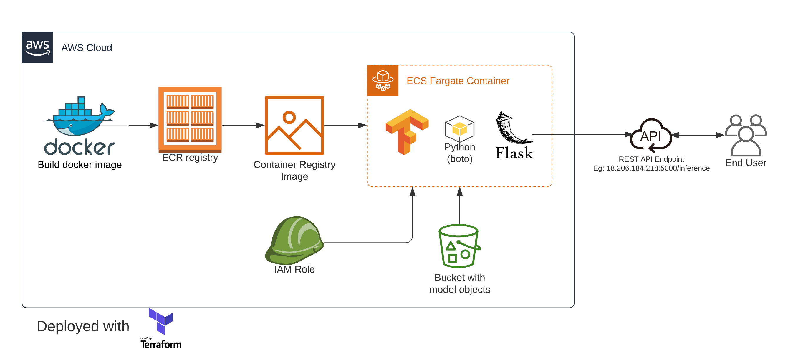
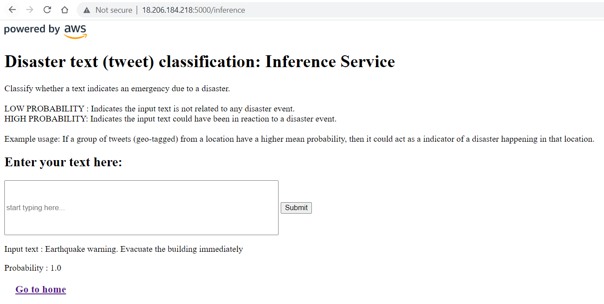

*Last Updated: April 16 2023*

#### [(Click here) Divert to develop branch for documentation of user_management_service](https://github.com/gskpsrikar/text_classifier_on_aws/tree/develop)

*Warning: This project deploys resources to Amazon Web Services and may incur cost to those who are trying to reproduce
the same. Please be aware of cloud costs.*
# End-to-end Machine Learning Pipeline on AWS
###### #MLOps #MLEngineering #CloudDevelopment #AmazonWebServices #AWS


___
## About
The purpose of this project is to:
- Develop a cloud solution to host language models.
- Deploy and manage cloud infrastructure as code.
- Serve machine learning model as REST API endpoint over web to end-user.
___
## Infrastructure overview

- **Cloud services**: Amazon Web Services
- **Packaging and Deployment**: Docker, Terraform
- **Backend**: Python, Flask, Boto3, Tensorflow
- **Simple User Interface**: HTML
___
## Setting up environment with AWS
Do the following tasks in order (refer to this) :
1. Get AWS user access key. 
2. Install AWS Tooklit for PyCharm. 
3. Install AWS CLI: Open command prompt and configure your aws user account by running aws configure. 
4. Docker. 
5. AWS SAM CLI. 
6. Install Terraform (for managing AWS resources).
___
## The Inference Service
### Model
For the language model, the training is done on the 
[Disaster Tweet Classification dataset](https://www.kaggle.com/competitions/nlp-getting-started)
which is publicly available on the Kaggle website. Building and saving the necessary model files can be generated from 
[gskpsrikar/ml-language-model-notebooks](https://github.com/gskpsrikar/ml-language-model-notebooks/blob/main/keras-text-classification-artifacts.ipynb).

Upload the artifacts to the S3 locations in the bucket ```text-classifier-on-aws```
```bazaar
1. Model file      : disaster_tweets/disaster-tweet-model.h5
2. Tokenizer       : disaster_tweets/disaster-tweet-tokenizer.pkl
3. Model parameters: disaster_tweets/disaster-tweet-modelling-params.pkl
```
<br>

### About the Inference service
**Purpose**: Allow users to input a text and receive a prediction probability.<br><br>
**Architecture (AWS Services)**
- **Access Management and Networking**: AWS IAM, Amazon Virtual Private Cloud
- **Storage**: S3, Elastic Container Registry
- **Compute**: AWS Elastic Container Service Tasks (FARGATE)

**Architecture diagram** <br>


**Demo example** <br>
___
## Appendix
### 1. Issues with tensorflow installation in Docker
I faced a lot of issues while trying to install Tensorflow in the ```docker build``` step. The reason being ```pip``` is 
unable to find the index for Tensorflow. I tried images like ``alpine, slim`` and so on, not couldn't resolve.Eventually
what worked for me  is using this (below) base image for the docker.
```docker
FROM python:3.10.1
```

### 2. Default VPC vs Custom VPC
To keep it simple (rather say easy), use the default VPC instead of creating a new VPC as that would involve steps to 
create Routing table, Internet Gateway, attaching Routing table to Internet Gateway. If you are okay with using default
VPC that comes with the AWS User Account, I suggest use the same. 

However, Security Groups could be configured to limit the IP traffic.